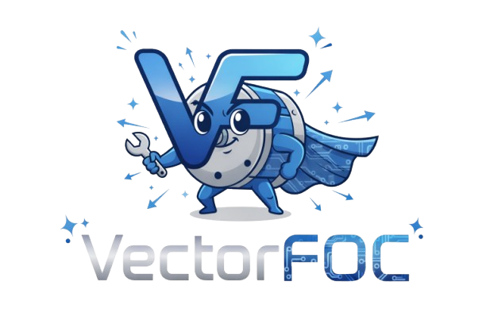

# VectorFOC

**High-performance Field-Oriented Control (FOC) firmware for STM32G431-based brushless motor controllers.**

[](https://github.com/kitjesen/vectorfoc/actions/workflows/vectorfoc-ci.yml)
[](LICENSE)



## Features

- **20 kHz current loop** — Clarke/Park transforms, SVPWM, PI with decoupling feedforward and anti-windup
- **Dual speed controller** — standard PID or Linear Active Disturbance Rejection Control (LADRC)
- **DS402 state machine** — full 9-state IEC 61800-7-201 implementation
- **Multi-sensor support** — MT6816 SPI magnetic encoder, Hall sensors, ABZ incremental encoder
- **Motor parameter calibration** — automated Rs/Ls/flux/encoder offset/pole-pair detection
- **Anti-cogging compensation** — 360-point cogging torque map
- **Control modes** — torque, velocity, position, trajectory, open-loop, MIT impedance
- **CAN communication** — Inovxio protocol + MIT protocol + CANopen-compatible addressing
- **USB debug interface** — VectorStudio oscilloscope (VoFA+) and parameter editor over USB CDC
- **FreeRTOS** — multi-task architecture with ISR-safe data exchange
- **Host-side unit tests** — 43 algorithm tests runnable on Linux/macOS/Windows without hardware

## Supported Hardware

| Board        | MCU        | Sensor          | USB | DRV chip |
|-------------|-----------|----------------|-----|----------|
| VectorFOC G431 | STM32G431CB | MT6816 (SPI)  | Yes | — |
| X-STAR-S    | STM32G431CB | Hall / ABZ      | No  | — |

Adding a new board requires only a single header in `Src/config/boards/` — see [Board Abstraction](#board-abstraction).

## Quick Start

### Prerequisites

- [xpack-arm-none-eabi-gcc](https://xpack.github.io/arm-none-eabi-gcc/) ≥ 12.x
- CMake ≥ 3.22
- `make` or `ninja`
- (Optional) STM32CubeProgrammer for flashing

### Build firmware

```bash
cmake -S . -B build \
  --toolchain cmake/gcc-arm-none-eabi.cmake \
  -DCMAKE_BUILD_TYPE=Release
cmake --build build -j$(nproc)
```

For X-STAR-S board, add `-DBOARD_XSTAR=1`.

### Run host tests (no hardware required)

```bash
cmake -S test -B build_test
cmake --build build_test -j$(nproc)
ctest --test-dir build_test -V
```

### Flash

```bash
# First-time: flash bootloader + application via SWD
st-flash write build_boot/VectorFoc_Bootloader.bin 0x08000000
st-flash write build/VectorFoc.bin 0x08004000

# Subsequent updates via USB OTA
python scripts/ota_upload.py build/VectorFoc.bin --port /dev/ttyUSB0
```

## Project Structure

```
VectorFOC/
├── Src/
│   ├── ALGO/           # Platform-independent algorithms
│   │   ├── foc/        # Clarke/Park/SVPWM/current loop
│   │   └── motor/      # State machine, calibration, fault detection
│   ├── APP/            # Application layer (RTOS tasks, ISR)
│   ├── COMM/           # Communication (CAN, USB, Inovxio/MIT protocols)
│   ├── HAL/            # Hardware abstraction (ADC, encoder, PWM drivers)
│   ├── UI/             # VectorStudio parameter table and debug scope
│   └── config/         # Board configuration
│       └── boards/     # Per-board header files
├── Lib/                # Third-party libraries (FreeRTOS, STM32 HAL)
├── test/               # Host-side unit tests (CMake, no HAL)
├── scripts/            # Utility scripts (OTA upload, comment translation)
├── docs/               # Architecture and design documents
└── cmake/              # CMake toolchain files
```

## Board Abstraction

All hardware-specific constants live in `Src/config/boards/board_<name>.h`. To support a new board:

1. Create `Src/config/boards/board_myboard.h` defining all `HW_*` macros (use `board_vectorfoc.h` as a template).
2. Add a routing clause in `Src/config/board_config.h`.
3. Pass `-DBOARD_MYBOARD=1` to CMake.

No algorithm source files need to change.

## Architecture Overview

```
┌──────────────┐   20 kHz ISR    ┌─────────────────────────────┐
│  ADC (Ia/b/c)│ ──────────────► │ Clarke → Park → PI_d/PI_q   │
│  VBus        │                 │ → Inv.Park → SVPWM → TIM1   │
└──────────────┘                 └────────────┬────────────────┘
                                              │ Vα/Vβ
                                    ┌─────────▼──────────┐
                                    │  SMO / Encoder      │ θ, ω
                                    └────────────────────┘
┌──────────────────────────────────────────────────────────┐
│              DS402 State Machine  (1 kHz)                │
│  IDLE → CALIBRATING → READY → ENABLED → FAULT            │
└──────────────────────────────────────────────────────────┘
┌──────────────┐   ┌──────────────┐   ┌──────────────────┐
│  Velocity PID│   │  LADRC       │   │  Position PID    │
│  or LADRC    │   │  (optional)  │   │  / Trajectory    │
└──────────────┘   └──────────────┘   └──────────────────┘
```

## Contributing

See [CONTRIBUTING.md](CONTRIBUTING.md).

## Security

See [SECURITY.md](SECURITY.md) for reporting vulnerabilities.

## License

Copyright 2024–2026 VectorFOC Contributors.
Licensed under the [Apache License, Version 2.0](LICENSE).
