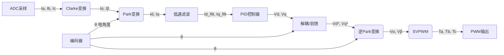
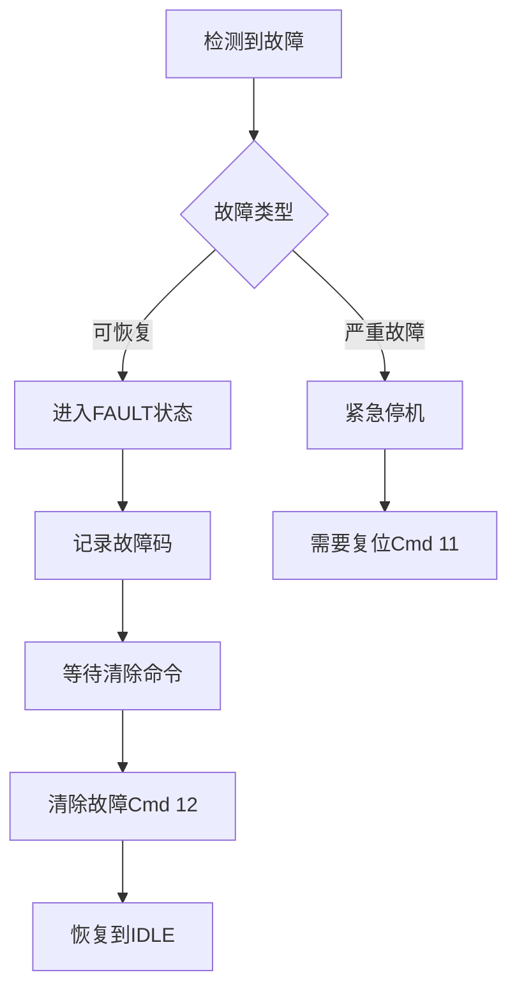

# VectorFoc 电机控制器固件


> **高性能无刷电机 FOC 驱动器** - 适用于机器人关节、工业伺服、协作机器人等应用场景

[]()
[]()
[]()
[]()
[]()
[]()

## 目录

- [功能特性](#功能特性)
- [硬件平台](#硬件平台)
- [快速开始](#快速开始)
- [控制模式](#控制模式)
- [通信协议](#通信协议)
- [故障保护](#故障保护)
- [项目结构](#项目结构)

---

## 功能特性

### 核心 FOC 算法

本固件实现了完整的矢量控制（FOC）链路，确保电机运行的高效与平滑。

#### 1. 坐标变换
*   **Clarke 变换** ($I_{abc} \to I_{\alpha\beta}$):
    $$
    \begin{cases}
    I_\alpha = I_a \\
    I_\beta = \frac{1}{\sqrt{3}}(I_a + 2I_b)
    \end{cases}
    $$
*   **Park 变换** ($I_{\alpha\beta} \to I_{dq}$):
    $$
    \begin{cases}
    I_d = I_\alpha \cos\theta + I_\beta \sin\theta \\
    I_q = -I_\alpha \sin\theta + I_\beta \cos\theta
    \end{cases}
    $$
*   **逆 Park 变换** ($V_{dq} \to V_{\alpha\beta}$):
    $$
    \begin{cases}
    V_\alpha = V_d \cos\theta - V_q \sin\theta \\
    V_\beta = V_d \sin\theta + V_q \cos\theta
    \end{cases}
    $$

#### 2. SVPWM 调制
采用**中点注入法**实现空间矢量调制，相比传统 SPWM 电压利用率提高 15.47%。
$$
\begin{cases}
V_{max} = \max(V_a, V_b, V_c) \\
V_{min} = \min(V_a, V_b, V_c) \\
V_{com} = -\frac{1}{2}(V_{max} + V_{min}) \\
V_{out} = V_{in} + V_{com}
\end{cases}
$$

#### 3. 电流环解耦
针对电机高速运行时 dq 轴耦合严重的问题，引入前馈解耦策略：
$$
\begin{cases}
V_d = PID(I_d^* - I_{d\_filt}) - \omega_e L_s I_{q\_filt} \\
V_q = PID(I_q^* - I_{q\_filt}) + \omega_e L_s I_{d\_filt} + \omega_e \psi_f
\end{cases}
$$

*   **低通滤波**: 对 dq 轴反馈电流进行低通滤波 (LPF)，提高控制稳定性
*   **快速三角函数**: 基于查找表 (LUT) 优化三角函数计算，耗时 < 100ns

#### 4. FOC 控制流程图解

整个 FOC 控制回路以 **20kHz (50μs)** 的频率周期运行，数据流向如下：



1.  **数据采集**: ADC 采集三相电流 ($I_a, I_b, I_c$) 和母线电压。
2.  **静止坐标变换 (Clarke)**: 将三相电流转换为两相静止坐标系电流 ($I_\alpha, I_\beta$)。
3.  **旋转坐标变换 (Park)**: 结合编码器角度 $\theta$，将电流投影到同步旋转坐标系 ($I_d, I_q$)。此时 $I_d$ 控制磁通（通常为0），$I_q$ 控制力矩。
4.  **闭环控制**: 
    *   将采样得到的 $I_d, I_q$ 与目标值对比。
    *   通过 PID 调节器计算出所需的电压矢量 $V_d, V_q$。
    *   加入前馈解耦项消除轴间耦合。
5.  **输出生成 (Inv Park + SVPWM)**:
    *   将 $V_d, V_q$ 逆变换回静止坐标系 $V_\alpha, V_\beta$。
    *   SVPWM 算法计算三相桥臂的占空比，驱动电机旋转。

### 7种控制模式

| 模式 | 说明 | 应用场景 |
|------|------|----------|
| **开环控制** | 直接电压控制 | 调试、低成本应用 |
| **力矩控制** | 电流/力矩闭环 | 力控机器人、张力控制 |
| **速度控制** | 速度闭环 | 风机、泵类负载 |
| **位置控制** | 位置闭环 | 精密定位 |
| **速度斜坡** | 带加速度限制 | 需平滑加速的场合 |
| **位置斜坡** | 梯形轨迹规划 | 点到点运动 |
| **MIT阻抗控制** | 刚度+阻尼控制 | 柔顺控制、机器人关节 |

### 11种故障保护

### 11种故障保护

系统实时监测（20kHz）各项物理指标，触发任意阈值即进入安全保护状态：

#### 电气保护
- ✅ **过压保护 (Over Voltage)**
  - 触发条件: 母线电压 > **60.0V**
  - 恢复条件: 需重启或发送故障清除命令
- ✅ **欠压保护 (Under Voltage)**
  - 触发条件: 母线电压 < **12.0V**
  - 目的: 保护电池不过放
- ✅ **过流保护 (Over Current)**
  - 触发条件: 任意相电流瞬时值 > **90.0A**
  - 响应: 立即封锁 PWM 输出 (硬件级响应)

#### 热保护
- ✅ **过温停机 (Over Temperature)**
  - 触发条件: MOS管/线圈温度 > **145℃**
  - 响应: 强制停机，冷却后需手动复位
- ✅ **过温预警 (Temp Warning)**
  - 触发条件: 温度 > **130℃**
  - 响应: 设置警告标志位（不影响运行，建议上位机主动降额）

#### 机械保护
- ✅ **堵转检测 (Stall Detection)**
  - 判定逻辑: **电流 > 80A** 且 **转速 < 0.1 rad/s**
  - 持续时间: 持续满足上述条件超过 **500ms**
- ✅ **超速保护 (Over Speed)**
  - 触发条件: 转速 > 120% 设定最大值 (默认 > 7200 RPM)
- ✅ **通信监控 (Watchdog)**
  - 功能: 可配置 CAN 总线超时停机 (默认关闭，可设为如 1000ms)

### 3种通信协议

#### 1. Inovxio/MinerU 私有协议（主推荐）
**特点**：高性能、功能最全、实时性强

| 命令 | 功能 | 说明 |
|------|------|------|
| Cmd 0 | 获取设备ID | 返回CAN ID和UUID |
| Cmd 1 | 运动控制 | 位置/速度/力矩/Kp/Kd混合控制 |
| Cmd 2 | 电机反馈 | 实时状态反馈 |
| Cmd 3/4 | 使能/停止 | 电机上下电 |
| Cmd 6 | 设置零点 | 当前位置设为零 |
| Cmd 7 | 设置CAN ID | 更改节点ID |
| Cmd 8 | 触发校准 | 启动自动校准 |
| Cmd 11 | 系统复位 | 软件复位MCU |
| Cmd 12 | 清除故障 | 恢复到IDLE状态 |
| Cmd 17/18 | 参数读写 | 远程参数配置 |
| Cmd 21 | 故障上报 | 主动故障反馈 |
| Cmd 22 | 保存参数 | 写入Flash |
| Cmd 25 | 协议切换 | 动态切换协议 |
| Cmd 26 | 获取版本 | 固件版本查询 |

#### 2. MIT Cheetah 协议
**特点**：轻量级、紧凑数据格式、适合机器人关节

- 12-bit 定点数编码（节省带宽）
- 阻抗控制专用
- 位置/速度/Kp/Kd/前馈力矩控制

#### 3. CANopen DS402 协议
**特点**：标准工业协议、兼容性强

- 符合 CiA 402 标准
- SDO/PDO 通信支持
- CST/CSV/CSP 循环同步模式
- DS402 标准状态机

### 完整校准功能

#### 1. 电流传感器校准
*   **零点自动校准**: 
    $$ I_{offset} = \frac{1}{N} \sum_{k=1}^{N} ADC(k) $$ 
    (系统上电时采样 1000 次取平均)

#### 2. 电阻与电感辨识 (R/L)
采用高频电压注入法测量电机电气参数。注意 VectorFoc 采用单相注入 (Phase A vs B//C)，故测量的是回路阻抗（1.5倍相阻抗），需进行换算：
*   **相电阻 ($R_s$)**: 施加恒定电流 $I_{calib}$，使得 $V_d$ 稳定，根据电路原理：
    $$ R_{total} = \frac{V_d}{I_{calib}} = 1.5 R_s \implies R_s = \frac{V_d}{I_{calib}} \times \frac{2}{3} $$
*   **相电感 ($L_s$)**: 施加高频方波电压 $\pm V_{step}$，测量电流响应斜率 $\frac{di}{dt}$：
    $$ L_s = \frac{V_{step}}{\frac{di}{dt}} \times \frac{2}{3} $$

#### 3. 编码器校准 (线性化)
*   **极对数检测**: 施加电压矢量旋转一圈机械角度，统计电角度周期数。
*   **零点与线性化**: 
    VectorFoc 实现了高精度的 **LUT (Look-Up Table)** 线性化补偿，而不仅仅是简单的零点偏移：
    1. 电机开环步进旋转 $N$ 个电周期。
    2. 记录每个位置的 `误差 = 电角度 - 机械角度 * PP`。
    3. 生成 128 点补偿表，运行时实时查表修正，大幅降低 Cogging Torque 引起的角度误差。

#### 4. 磁链辨识 (Flux)
*   **反电动势法**: 驱动电机恒速空载旋转，根据电压方程反算：
    $$ \psi_f = \frac{V_q - R_s I_q}{\omega_e} $$
    (其中 $\omega_e$ 为电角速度，算法包含自动加减速与稳态检测)

### 参数管理系统

-    **Flash 持久化** - 参数断电保存
-    **远程读写** - CAN总线参数配置
-    **参数表结构化** - 0x2000-0x3FFF编址
-    **访问权限控制** - 只读/读写分级
-    **参数校验** - 范围检查与有效性验证

---


---

## 硬件配置参考 (Hardware Configuration)

本固件基于特定的硬件参数进行计算，如需修改硬件设计，请参考以下关键参数：

### 1. 母线电压采样 (VBUS Sensing)
采用电阻分压电路，系统默认配置为 **11倍** 分压。

*   **电路设计**:
    *   **R_up (上拉/串联)**: 10kΩ
    *   **R_down (下拉)**: 1kΩ
    *   **分压比公式**: $\text{Ratio} = \frac{R_{up} + R_{down}}{R_{down}} = \frac{10k + 1k}{1k} = 11$
*   **计算逻辑**: 真实电压 = ADC采集电压 × 11

### 2. 温度采样 (NTC Sensing)
采用 NTC 热敏电阻与定值电阻串联分压，NTC 位于 **下拉 (Pull-down)** 位置。

*   **NTC 参数**:
    *   **阻值 (R25)**: 10kΩ (@ 25℃)
    *   **B 值**: 3950
*   **分压电阻**: 10kΩ (上拉至参考电压)
*   **ADC 计算**: 采用查表法 (LUT) 将 ADC 值转换为摄氏度，表数据基于 B 值公式生成。

### 3. 电流采样 (Current Sensing)
低侧采样 (Low-side Shunt) 或在线采样 (In-line)，具体取决于硬件实现，默认参数如下：

*   **采样电阻 (Shunt)**: 0.02Ω (20mR)
*   **运放增益 (Gain)**: 50V/V
*   **量程**: 取决于 ADC 参考电压与偏置电压。

---


### 4. 硬件引脚映射 (Pinout Mapping)

详细的 MCU 引脚与外设对应关系如下表所示：

| 功能模块 | 引脚号 | 外设通道 | 网络标签 (Label) | 描述 |
| :--- | :--- | :--- | :--- | :--- |
| **电机驱动** | **PA8** | TIM1_CH1 | HIN1/U_H | U相上桥臂 PWM |
| | **PA9** | TIM1_CH2 | HIN2/V_H | V相上桥臂 PWM |
| | **PA10** | TIM1_CH3 | HIN3/W_H | W相上桥臂 PWM |
| | **PB13** | TIM1_CH1N | LIN3 (?) | U相下桥臂 PWM |
| | **PB14** | TIM1_CH2N | LIN2 | V相下桥臂 PWM |
| | **PB15** | TIM1_CH3N | LIN1 | W相下桥臂 PWM |
| **电流采样** | **PA0** | ADC1_IN1 | Current_Ic | C相电流采样 |
| | **PA1** | ADC1_IN2 | Current_Ib | B相电流采样 |
| | **PA2** | ADC1_IN3 | Current_Ia | A相电流采样 |
| | **PA3** | ADC1_IN4 | Current_IBUS | 母线电压/总电流采样 |
| **温度采样** | **PB2** | ADC2_IN12 | TEMP | NTC温度传感器 (10k) |
| **编码器** | **PB3** | SPI3_SCK | - | 磁编码器时钟 |
| | **PB4** | SPI3_MISO | - | 磁编码器数据 |
| | **PB5** | SPI3_MOSI | - | 磁编码器指令 |
| | **PB12** | GPIO_Out | SPI3_CS | 磁编码器片选 |
| **预驱配置** | **PA5** | SPI1_SCK | - | DRV8323/预驱时钟 |
| | **PA6** | SPI1_MISO | - | DRV8323/预驱数据 |
| | **PA7** | SPI1_MOSI | - | DRV8323/预驱指令 |
| | **PC4** | GPIO_Out | SPI1_CS | 预驱芯片片选 |
| **通信接口** | **PB8** | FDCAN1_RX | - | CAN总线接收 |
| | **PB9** | FDCAN1_TX | - | CAN总线发送 |
| | **PB6** | USART1_TX | - | 串口发送 (调试/预留) |
| | **PB7** | USART1_RX | - | 串口接收 |
| | **PA11/12** | USB | D-/D+ | **VOFA+ 上位机连接** (虚拟串口) |
| **其他** | **PA4** | TIM3_CH2 | WS2812 | RGB LED控制信号 |
| | **PC13** | GPIO_Out | LED1 | 状态指示灯 |

---

ADC1 (电流采样 - 注入模式)
通道	引脚	功能	触发方式
ADC1_IN1	PA0	Ic (C相电流)	TIM1_CC4 触发
ADC1_IN2	PA1	Ib (B相电流)	TIM1_CC4 触发
ADC1_IN3	PA2	Ia (A相电流)	TIM1_CC4 触发
ADC1_IN4	PA3	IBUS (母线电流)	TIM1_CC4 触发
ADC2 (温度采样 - DMA 模式)
通道	引脚	功能	触发方式
ADC2_IN12	PB2	温度传感器	软件触发/DMA

## 硬件平台


### 支持的MCU
- **STM32G431** (主推荐) - ARM Cortex-M4F @ 170MHz
  - 高性能DSP指令
  - 硬件FPU浮点运算
  - 多通道高速ADC

### 支持的编码器
- **MT6816** (14-bit SPI磁编码器)
  - 16384 counts/rev
  - SPI高速读取
  - 零点可配置

### 外设需求
- **三相逆变器** - MOSFET/IGBT驱动
- **电流传感器** - 3路相电流采样
- **CAN收发器** - 通信接口

### 性能指标
| 指标 | 值 |
|------|-----|
| 电流环频率 | 20kHz |
| 速度/位置环 | 5kHz |
| CAN总线速率 | 1Mbps |
| 编码器分辨率 | 14-bit (0.022°) |
| 电压范围 | 12V ~ 60V |
| 最高温度 | 145℃ |

---

## 快速开始

### 1. 编译固件

```bash
# 克隆仓库
git clone https://github.com/Kitjesen/Vectorfoc.git
cd Vectorfoc

# 使用CMake编译
mkdir build && cd build
cmake ..
cmake --build .
```

### 2. 烧录固件

使用 STM32CubeProgrammer 或 OpenOCD 烧录 `VectorFoc.elf` 到目标板。

### 3. 初始配置

```bash
# 通过CAN总线发送配置命令
# 1. 设置CAN ID (例如: ID=1)
cansend can0 007#0100000000000000

# 2. 触发电流校准
cansend can0 008#00

# 3. 触发编码器校准  
cansend can0 008#02

# 4. 保存参数到Flash
cansend can0 016#
```

### 4. 启动电机

```bash
# 使能电机
cansend can0 003#

# 发送速度控制命令 (例如: 10 rad/s)
cansend can0 001#...
```

---

## 控制模式详解

### 开环控制 (OPEN)
直接设置三相电压，无反馈闭环  
**用途**：调试、测试、低成本应用

### 力矩控制 (TORQUE)
恒定力矩输出，电流闭环  
**公式**：`τ = Kt × Iq`  
**用途**：力控机器人、张力控制

### 速度控制 (VELOCITY)
恒速运行，速度环+电流环  
**公式**：`Iq = PID_vel(ω_ref - ω_act)`  
**用途**：风机、水泵、输送带

### 位置控制 (POSITION)
精确定位，位置环+速度环+电流环  
**公式**：`ω_ref = PID_pos(θ_ref - θ_act)`  
**用途**：机械臂、精密平台

### MIT阻抗控制 (MIT)
柔顺控制，适合机器人关节  
**公式**：`τ = Kp×(θ_des - θ) + Kd×(ω_des - ω) + τ_ff`  
**用途**：协作机器人、柔性抓取

---

## 通信协议示例

### Inovxio 协议 - 运动控制命令

```c
// CAN ID结构: [Cmd(5)][Data(16)][TargetID(8)]
// 命令1: 运动控制
// ID = 0x01000001 (Cmd=1, Target=1)
// Data: [Pos_H][Pos_L][Vel_H][Vel_L][Kp_H][Kp_L][Kd_H][Kd_L]

// 示例: 位置=0, 速度=0, Kp=50, Kd=5
uint8_t data[8] = {
    0x80, 0x00,  // Pos = 0 (编码为32768)
    0x80, 0x00,  // Vel = 0  
    0x19, 0x99,  // Kp = 50
    0x0C, 0xCC   // Kd = 5
};
```

### MIT 协议 - 阻抗控制

```c
// 8字节紧凑格式
// [Pos(16)][Vel(12)][Kp(12)][Kd(12)][Torque(12)]
```

---

## 故障处理流程



---

## 项目结构

```
VectorFoc/
├── MODULES/
│   ├── motor/
│   │   ├── core/          # 电机核心数据结构
│   │   ├── control/       # 控制算法 (modes.c等)
│   │   ├── foc/           # FOC算法 (clarke/park/svpwm)
│   │   ├── calibration/   # 校准功能
│   │   ├── safety/        # 故障检测
│   │   ├── fsm/           # 状态机管理
│   │   └── hal/           # 电机硬件抽象层
│   ├── encoder/
│   │   └── MT6816/        # MT6816编码器驱动
│   ├── communication/
│   │   ├── inovxio/       # Inovxio协议
│   │   ├── mit/           # MIT协议
│   │   ├── canopen/       # CANopen协议
│   │   └── manager.c      # 协议管理器
│   ├── algorithm/
│   │   ├── pid.c          # PID控制器
│   │   ├── trap_traj.c    # 梯形轨迹
│   │   └── rate_limiter.c # 速率限制
│   ├── hal/               # 板级硬件抽象 (Led/Flash等)
│   └── parameter/         # 参数管理
├── Core/                  # STM32 HAL初始化
└── CMakeLists.txt         # 构建配置
```

---

## 配置说明

### 修改电机参数

编辑 `MODULES/motor/core/motor_config.h`:

```c
#define MOTOR_POLE_PAIRS    7      // 极对数
#define MOTOR_RESISTANCE    0.5f   // 相电阻 [Ω]
#define MOTOR_INDUCTANCE    0.001f // 相电感 [H]
#define MOTOR_FLUX          0.08f  // 磁链 [Wb]
```

### 调整PID参数

```c
// 电流环
motor.IdPID.Kp = 0.5f;
motor.IdPID.Ki = 50.0f;

// 速度环  
motor.VelPID.Kp = 0.1f;
motor.VelPID.Ki = 0.5f;

// 位置环
motor.PosPID.Kp = 20.0f;
motor.PosPID.Ki = 0.0f;
```

---

## 性能优化建议

1. **提高电流环频率** - 修改 `TIM1_ARR` 值
2. **优化PID参数** - 使用自整定算法
3. **启用DMA传输** - 减少CPU占用
4. **使用编译器优化** - `-O2` 或 `-O3`

---

## 常见问题

### Q: 电机不转？
**A**: 检查以下项目：
1. 电机是否使能 (发送Cmd 3)
2. 编码器是否已校准
3. 电流传感器零点是否正确
4. PWM信号是否输出

### Q: 抖动严重？
**A**: 可能原因：
1. PID参数不合适 - 降低Kp
2. 电流采样噪声大 - 增加滤波
3. 编码器分辨率不够 - 更换高分辨率编码器

### Q: 频繁过流保护？
**A**: 检查：
1. 电流限制设置是否过小
2. 负载是否过重
3. 电机参数是否正确

---

## 许可证

本项目采用 MIT 许可证 - 详见 [LICENSE](LICENSE) 文件

---

## 贡献指南

欢迎提交 Issue 和 Pull Request！

1. Fork 本仓库
2. 创建特性分支 (`git checkout -b feature/AmazingFeature`)
3. 提交更改 (`git commit -m 'Add some AmazingFeature'`)
4. 推送到分支 (`git push origin feature/AmazingFeature`)
5. 开启 Pull Request

---

## 联系方式

- **问题反馈**: [GitHub Issues](https://github.com/your-repo/issues)
- **技术支持**: support@example.com

---

## 致谢

- STM32 HAL库
- MIT Cheetah 开源项目
- Robstride/Inovxio 协议文档

---
